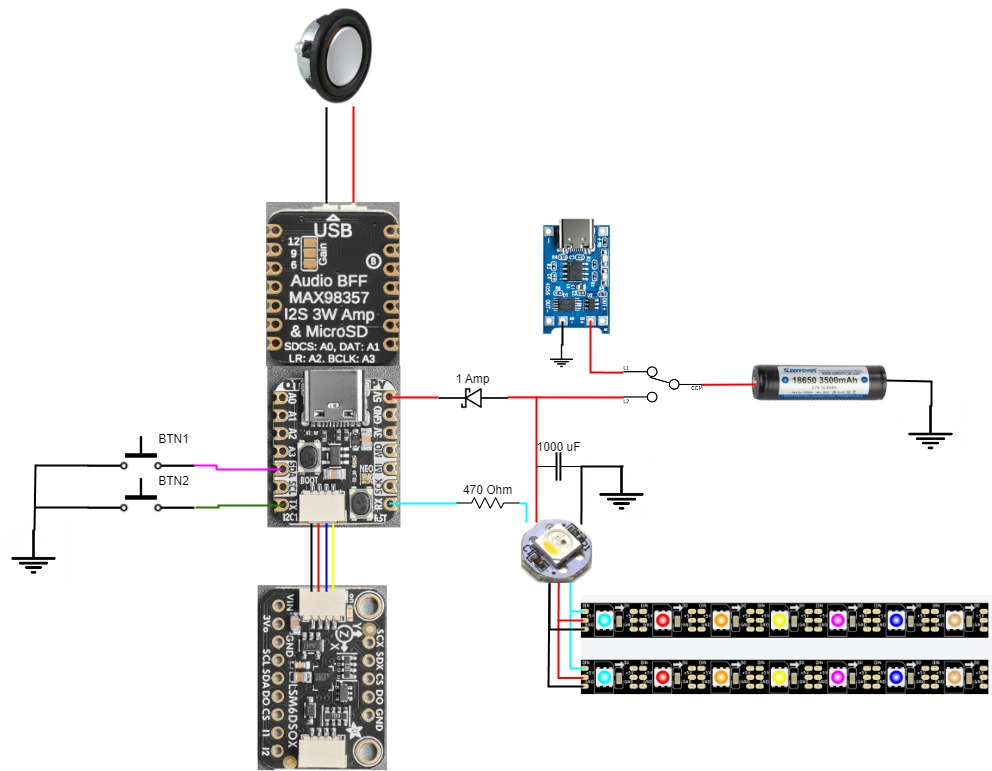
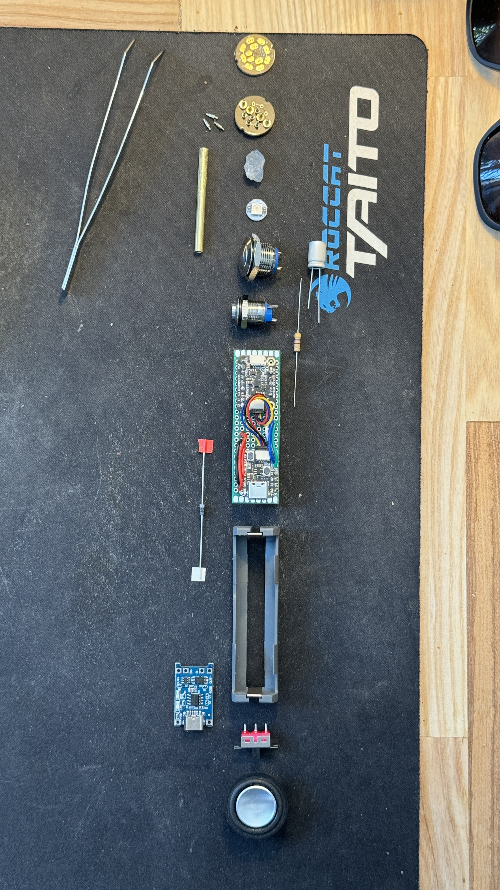
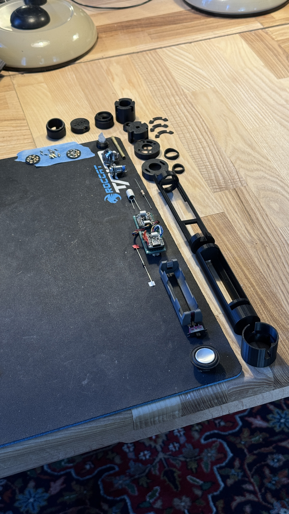
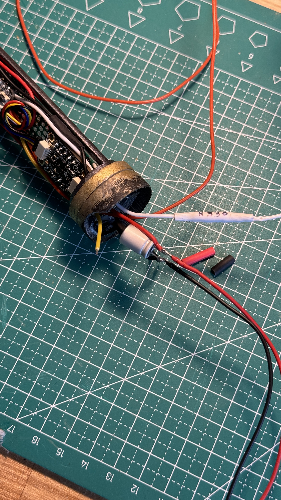
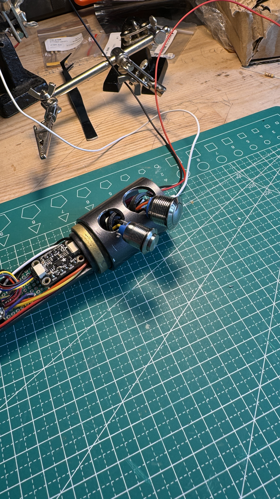
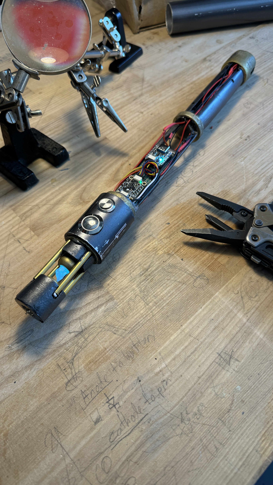
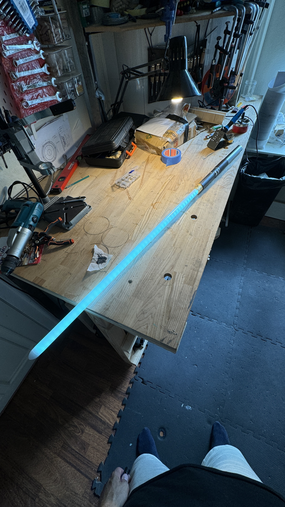
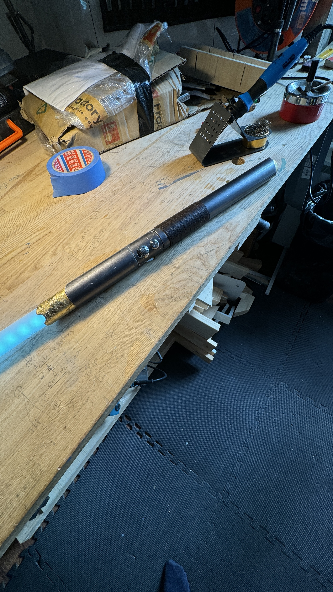

# The Pythosaber project

The Pythosaber is a lightsaber soundboard project based on the Raspberry Pi RP2040 microcontroller.  

The program is written in [CircuitPython](https://github.com/adafruit/circuitpython).  

This is version 1 of the project that I've dubbed "The Initiate".  

## Inspiration

This project was started as a way to self-teach embedded programming, and coding in general.  
I've always wanted to learn how to code, and I like lightsabers, and I like to tinker with electronics - so here we are.

## Features

The project features:  
- Two momentary pushbuttons:  
    - Button 1 is for cycling the lightsabers' power (blade in-out);  
    - Button 2 is auxiliary action. Currently this is only used to cycle through soundfonts.  
- Animated Neopixel blade;  
- Soundfonts, loaded from a microSD card;  
- Gyroscope for swinging motion detection;  
- An interpretation of the SmoothSwing v2 algorithm by Thexter for mixing audio playback (more on that below).  

## Hardware

*This specific build* uses the following electronic components:  
- Adafruit QT Py RP2040 microcontroller;  
- Adafruit QT Py Audio BFF; 
- microSD card;  
- ABS-266-RC 28mm 2 Watt 8 Ohm miniature speaker;  
- Adafruit LSM6DSOX 6-DOF inertial measurement unit;  
- 2x strips of 53 Neopixel (WS2812) LEDs;  
- 1x Neopixel LED button;  
- TC4056A Li-ion/Li-po charging module (USB-C);  
- Keepower 18650 Li-ion 3120mAh 15A battery;  
- 1x Schottky diode;  
- 1x 1000 µF capacitor;  
- 1x 470 Ohm resistor;  
- 1X SPDT slide switch;  
- 2x Momentary pushbutton switch (I chose 16mm and 12mm anti-vandal switches);  
- Adafruit STEMMA QT / Qwiic JST SH 4-pin cable;  
- Molex Picoblade cable;  
- Keystone 18650 battery holder with THT pins;  
- A prototyping board;  
- Male pin headers;  
- Multicolored 0.2 mm2 (24 AWG) stranded wires; 
- Heat shrink;   
- PCB connector with pogo pins. I used [this specific product](https://www.etsy.com/listing/872178596/connecteur-pcb-interne-18a-8-x-2a?click_key=00da230c1a36d1d55ee2f35ddc81e8ef694433ab%3A872178596&click_sum=404b2f56&ref=shop_home_active_12) (not an affiliate link).  
- Polycarbonate lightsaber blade;  

## Wiring

- The battery + is wired to the common line of the SPDT slide switch, the battery - is grounded.  
- One line from the switch is wired to the B+ pin on the TC4056A charging module.  
- The B- pin on the charging module is grounded.  
- The second line from the switch is split:  
    - One end is wired to the Scottky diode, whis is wired to the 5V pin on the QT Py RP2040.  
    - The other end is wired to the the positive terminal of the capacitor, which is then wired to the +5V pin on the crystal chamber LED. The negative terminal of the capacitor is grounded.  
- The QT Py RP2040 and QT Py Audio BFF are soldered together using pin headers, with the prototype board sandwiched between them.  
- Buttons 1 and 2 are wired to the SDA and SCL pins respectively.  
- The RX pin is wired to the 470 Ohm resistor, which is then wire to the DIN pin of the crystal chamber LED. Adafruit suggests the resistor to be closer *to the LED* than it is to the microcontroller.  
- The DOUT pin of the crystal LED splits in two and is wired to the DIN pins of both Blade LED strips.  
- The LSM6DSOX IMU is connected to the QT Py RP2040 using a STEMMA cable.  
- The speaker is connected to the QT Py Audio BFF using the Molex Picoblade cable.  

  

## Sound

The implementation of soundfonts aims to copy the Proffieboard soundfont folder structure and naming convention, although this can easily be changed in the code.  

The soundfiles need to be 22kHz mono .wav files, 16-bit signed PCM.  
During my development I used soundfonts from [Greyscale Fonts](https://www.greyscalefonts.com/).  
The soundfonts I used from Greyscale Fonts were the Proffie version.  
I then used Audacity to resample the sounds I needed to 22050 Hz, make them mono and export as 16-bit signed PCM .wav files.  

### Smoothswing v2

The SmoothSwing v2 portion of the code is more of an amateurs (that's me!) higly inspired interpretation. I wouldn't go as far to call it an actual implementation. That would be an insult to the awesome work done by Thexter.
A more detailed write-up and discussion on the algorithm can be found [here](https://therebelarmory.com/thread/9138/smoothswing-v2-algorithm-description) (registration required).  

## Folder structure

The folder structure for the microSD card is as follows:  
.  
├── config.json  
├── _sounds  
│   ├── _soundfont_name
│   │   ├── font.wav  
│   │   ├── hum.wav  
│   │   ├── _clsh  
│   │   │   └── clsh1.wav    
│   │   ├── _in  
│   │   │   └── in1.wav  
│   │   ├── _out  
│   │   │   └── out1.wav  
│   │   ├── _swingh  
│   │   │   └── swingh1.wav  
│   │   ├── _swingl  
│   │   │   └── swingl1.wav  

## Installation

This project is written for version 9.0.5 of CircuitPython.  

1. Flash your microcontroller with the appropriate CicuitPython firmware. Instructions can be found [here](https://learn.adafruit.com/welcome-to-circuitpython/installing-circuitpython) or by googling instructions for your specific board;  
2. Clone this repository or download the "main" folder;  
3. From the "main" folder, copy the code.py to the root of your CircuitPython device and the contents of the "lib" folder into the "lib" folder on your device. Alternatively the modules in the "lib" folder can be found from the [CircuitPython libraries bundle](https://circuitpython.org/libraries).  
4. Copy the config.json from the "main" folder to the root of the microSD.  
5. Copy any soundfont you have into the "sounds" folder with the right [structure](#folder-structure);  
6. Configure the config.json file for your soundfonts;  

## Configuration
The configuration of the lightsaber is done with the config.json file that is read from the microSD card.

## The build

The design of the saber is crude and amateur. It is clearly a first try and as such I'm hesitant to share 3D models. The dimensions were mostly off since I'm new to modelling for printing, and ultimately instead of printing all of the parts again I decided to just file and sand down the parts to their correct sizes. I haven't gone back to fix the 3D designs yet.  

The hilt was constructed out of aluminium, cut to length with a hacksaw, holes drilled with an electrical hand drill and various drill bits and worked on with sandpaper and files. Finished with different paints. Nothing fancy. Just a small exercise in creativity and handcrafting.  

The "brains" of the project i.e the RP2040, Audio BFF, LSM6DSOX and charging module were soldered to a prototype board with pin headers and necessary wires leading away from the board.  

  

The internal chassis and crystal chamber parts were modelled in Blender and 3D printed.  

  

I had no idea what I was doing as I was modeling this, so the dimensions for each part ended up being either too large or too small by a millimeter. I decided to not fix it in 3D to reprint, but instead sand and file everything to size by hand. I used 5-minute epoxy to glue the parts together, and painted them. Then I began installing components to the chassis.  

  

The capacitor and resistor fit nicely inside the button section of the hilt.  

  

  

I then assebled the crystal chamber and attached the blade connector PCB on top. For the crystal I used a piece that *fell off* my wifes geode that was sitting in a corner somewhere. In addition to the 3D printed parts I also used 3mm brass tubes to route wires through.  

  

  

The blade is just the two Neopixel strips glued back to back with a piece of material (insulating tape in this case) between them to prevent shorting. The pins are then soldered to the PCB connector.  

The hilt was then finished and so was the project.  

  

  

[Video demo](https://youtu.be/RXcyn-QDOxE)  

*The soundfonts used in the video demo are:*  
*- Grey*  
*- Masterless*  
*- Stitched*  
*By [Greyscale Fonts](https://www.greyscalefonts.com/)*  

## To-do

- Implement clashing: this will be done with the accelerometer.  
- Better memory management.
- Full support for Proffie style soundfonts.  
- Implement into the SmoothSwing V2 algorithm interpretation the selecting of different swingl and swingh sounds while not swinging.  
- Better code organization: breaking the code up into modules and/or classes.  
- Implement better exception handling throughout the program.  
- Fix issue with initial swinging sound starting too abruptly after blade ignition.  

## Conclusion

As stated, this is a very amateur and crude project both in terms of the actual build and the code as well.  
It is a learning project that I intend to improve upon as I myself improve in my coding and making journey.  
I'm sharing this to perhaps inspire or be of use otherwise.  

Thank You for checking this project out!  